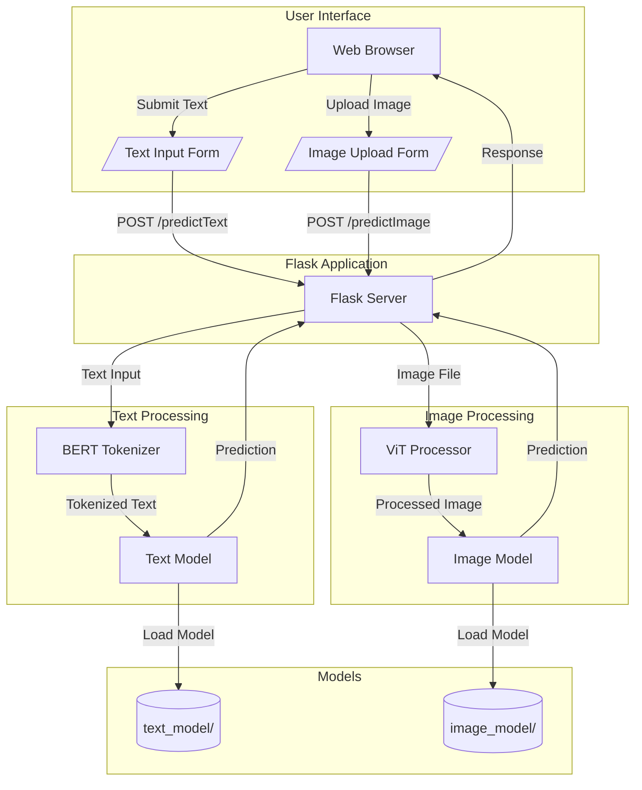

# AI Detection System (Detect AI)

A Flask-based web application that detects whether text or images are AI-generated using pre-trained BERT and ViT models.

## 🔍 Features

- Text Analysis: Detect AI-generated vs human-written text using BERT
- Image Analysis: Identify AI-generated vs real images using Vision Transformer (ViT)
- Web Interface: Easy-to-use web forms for both text and image uploads
- Confidence Scores: Get probability scores along with predictions

## 🛠️ System Architecture



## 📋 Prerequisites

- Python 3.8+
- PyTorch
- TensorFlow
- Flask
- Transformers library
- PIL (Python Imaging Library)

## 🚀 Installation

1. Clone the repository:
```bash
git clone https://github.com/yadavadarsh55/AI-Detection.git
cd AI-Detection
```

2. Create and activate a virtual environment:
```bash
python -m venv venv
source venv/bin/activate  # On Windows use: venv\Scripts\activate
```

3. Install required packages:
```bash
pip install -r requirements.txt
```

4. Project structure:
```
AI-Detection/
├── app.py
├── text_model_train.py
├── image_model_train.py
├── requirements.txt
├── text_model/          # Pre-trained BERT model folder
├── image_model/         # Pre-trained ViT model folder
└── templates/
    ├── home.html
    ├── about.html
    ├── contact.html
    ├── textModel.html
    ├── imageModel.html
    ├── checkText.html
    └── checkImage.html
```

## 🏃‍♂️ Running the Application

1. Ensure model folders are present:
   - `text_model/` directory containing the BERT model files
   - `image_model/` directory containing the ViT model files

2. Start the Flask server:
```bash
python app.py
```

3. Access the application:
Open your web browser and navigate to `http://localhost:8000`

## 🔄 API Endpoints

### Web Interface Endpoints
- `/`: Home page
- `/about/`: About page
- `/contact/`: Contact page
- `/textModel/`: Text analysis interface
- `/imageModel/`: Image analysis interface
- `/checkText/`: Text checking form
- `/checkImage/`: Image checking form

### Prediction Endpoints
- `/predictText/`: Text prediction endpoint (POST)
  - Input: Form data with 'user_text' field
  - Output: Prediction (AI-generated/Human-written) with confidence score

- `/predictImage/`: Image prediction endpoint (POST)
  - Input: Form data with 'image' file
  - Output: Prediction (FAKE/REAL) with confidence score

## 📊 Models

### Text Model (BERT)
- Located in `text_model/` directory
- Binary classification (AI-generated vs Human-written)
- Uses BERT tokenizer for text preprocessing
- Returns prediction with confidence percentage

### Image Model (ViT)
- Located in `image_model/` directory
- Binary classification (FAKE vs REAL)
- Uses ViT processor for image preprocessing
- Supports common image formats (JPEG, PNG)
- Returns prediction with confidence percentage

## 💻 Usage Examples

### Text Analysis
```python
from text_model_train import predict_text
from transformers import BertTokenizer, TFBertForSequenceClassification

text_model = TFBertForSequenceClassification.from_pretrained("./text_model")
tokenizer = BertTokenizer.from_pretrained("./text_model")

text = "Your text to analyze"
prediction, confidence = predict_text(text, tokenizer, text_model)
print(f"Prediction: {prediction}, Confidence: {confidence:.2f}%")
```

### Image Analysis
```python
from image_model_train import predict_single_image, preprocess_image
from transformers import ViTForImageClassification, ViTImageProcessor

image_model = ViTForImageClassification.from_pretrained("./image_model")
processor = ViTImageProcessor.from_pretrained("./image_model")

image_path = "path_to_your_image.jpg"
inputs = preprocess_image(image_path, processor)
prediction, confidence = predict_single_image(image_path, image_model, processor, inputs)
print(f"Prediction: {prediction}, Confidence: {confidence:.2f}")
```

## 🤝 Contributing

1. Fork the repository
2. Create your feature branch (`git checkout -b feature/AmazingFeature`)
3. Commit your changes (`git commit -m 'Add some AmazingFeature'`)
4. Push to the branch (`git push origin feature/AmazingFeature`)
5. Open a Pull Request

## ⚖️ License

MIT License

## 📧 Contact

- GitHub: [@yadavadarsh55](https://github.com/yadavadarsh55)
- Project Link: [https://github.com/yadavadarsh55/AI-Detection](https://github.com/yadavadarsh55/AI-Detection)

## 🙏 Acknowledgments

- Transformers library from Hugging Face
- Flask web framework
- PyTorch and TensorFlow frameworks
- Dataset from Kaggle for model training
