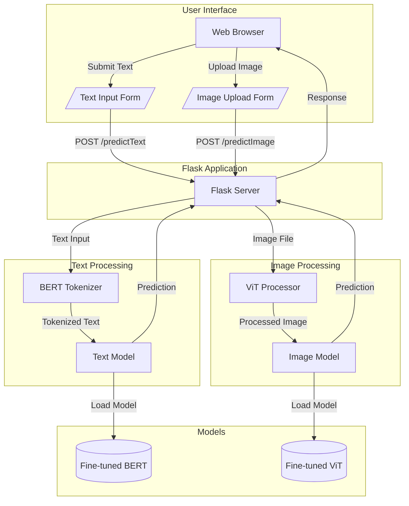

# AI Detection System

A Flask-based web application that detects whether text or images are AI-generated using fine-tuned BERT and ViT models.

## 🔍 Features

- Text Analysis: Detect AI-generated vs human-written text using BERT
- Image Analysis: Identify AI-generated vs real images using Vision Transformer (ViT)
- Web Interface: Easy-to-use web forms for both text and image uploads
- Confidence Scores: Get probability scores along with predictions

## 🛠️ System Architecture



## 📋 Prerequisites

- Python 3.8+
- PyTorch
- TensorFlow
- Flask
- Transformers library
- KaggleHub
- PIL (Python Imaging Library)

## 🚀 Installation

1. Clone the repository:
```bash
git clone [your-repo-url]
cd [your-repo-name]
```

2. Create and activate a virtual environment:
```bash
python -m venv venv
source venv/bin/activate  # On Windows use: venv\Scripts\activate
```

3. Install required packages:
```bash
pip install flask transformers tensorflow torch pillow kagglehub
```

4. Set up the project structure:
```
project_root/
├── app.py
├── text_model_train.py
├── image_model_train.py
├── templates/
│   ├── home.html
│   ├── about.html
│   ├── contact.html
│   ├── textModel.html
│   ├── imageModel.html
│   ├── checkText.html
│   └── checkImage.html
├── text_model/
└── image_model/
```

## 🏃‍♂️ Running the Application

1. Train the models (optional - skip if using pre-trained models):
```bash
python text_model_train.py
python image_model_train.py
```

2. Start the Flask server:
```bash
python app.py
```

3. Access the application:
Open your web browser and navigate to `http://localhost:8000`

## 🔄 API Endpoints

- `/`: Home page
- `/about/`: About page
- `/contact/`: Contact page
- `/textModel/`: Text analysis interface
- `/imageModel/`: Image analysis interface
- `/checkText/`: Text checking form
- `/checkImage/`: Image checking form
- `/predictText/`: Text prediction endpoint (POST)
- `/predictImage/`: Image prediction endpoint (POST)

## 📊 Model Details

### Text Model (BERT)
- Base model: bert-base-uncased
- Fine-tuned on custom dataset
- Binary classification (AI-generated vs Human-written)
- Returns confidence scores with predictions

### Image Model (ViT)
- Base model: facebook/deit-tiny-patch16-224
- Fine-tuned on AI-generated vs real images dataset
- Binary classification (FAKE vs REAL)
- Includes preprocessing for various image formats

## 🤝 Contributing

1. Fork the repository
2. Create your feature branch (`git checkout -b feature/AmazingFeature`)
3. Commit your changes (`git commit -m 'Add some AmazingFeature'`)
4. Push to the branch (`git push origin feature/AmazingFeature`)
5. Open a Pull Request

## ⚖️ License

[Add your license information here]

## 📧 Contact

[Add your contact information here]

## 🙏 Acknowledgments

- BERT model from Hugging Face
- ViT implementation from Facebook Research
- Flask web framework
- Transformers library from Hugging Face